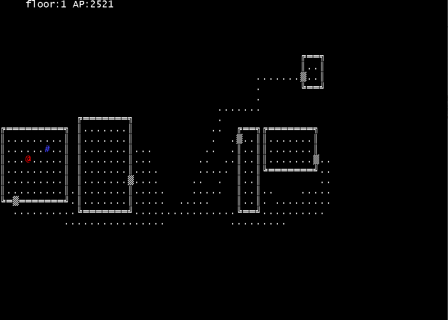

# DungeonEscape
한국정보올림피아드2018 공모전 부문 출품작

실행
---------------------
dungeonescape.exe 실행

빨간색 '@'를 방향키를 이용하여 '.'로 되어있는 무작위로 생성된 맵을 돌아다니며 맵에 있는 파란색 '#'를 찾아가는 게임입니다

각 맵은 '층(floor)'이며, 층이 높을수록 방의 갯수가 많아지며 맵을 돌아다니기 더 힘들어집니다.

AP는 매 층마다 2800AP가 주어지며, 한칸을 움직일때마다 1씩 떨어집니다. 파란 '#'를 찾지 못하고 다음 층으로 이동하지 못한 체 AP가 0이 되면 게임이 종료됩니다.

구조
--------------
